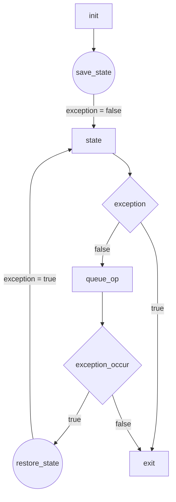
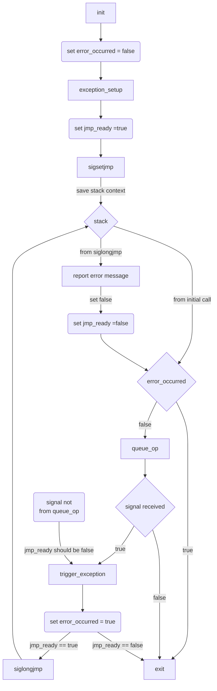

# L01: [lab0](https://hackmd.io/@sysprog/linux2023-lab0)

> 主講人: [jserv](http://wiki.csie.ncku.edu.tw/User/jserv) / 課程討論區: [2023 年系統軟體課程](https://www.facebook.com/groups/system.software2023/)
:mega: 返回「[Linux 核心設計/實作](http://wiki.csie.ncku.edu.tw/linux/schedule)」課程進度表

## 以 [Valgrind](https://valgrind.org/) 分析記憶體問題

[Valgrind](https://valgrind.org/) 是個在使用者層級 (user space) 對程式在執行時期的行為提供動態分析的系統軟體框架，具備多種工具，可以用來追蹤及分析程式效能，最為人們所熟知的特性就是幫助使用者偵測記憶體錯誤，諸如使用未初始化的記憶體、不當的記憶體配置、或取消配置記憶體，並加以分析。所有工具都包含在 valgrind 套件中，可以透過以下命令執行：
```shell
$ valgrind --tool=<toolname> <program>
```

以記憶體追蹤工具來說，上述 toolname 可以是 memcheck, massif, 或 cachegrind。請注意，使用 Valgrind 時，會讓程式執行速度比平常更慢。

依據 [Valgrind is *NOT* a leak checker](http://maintainablecode.logdown.com/posts/245425-valgrind-is-not-a-leak-checker) 的描述:
> Valgrind is an undefined behavior checking tool first, a function and memory profiler second, a data-race detection tool third, and a leak checking tool last.

dynamic Binary Instrumentation (DBI) 著重於二進位執行檔的追蹤與資訊彙整，而 dynamic Binary Analysis (DBA) 則強調對收集資訊的分析。上述 [Valgrind](https://valgrind.org/) 是個 DBI 系統框架，可建構一系列 DBA 工具，藉由 shadow values 技術來實作，後者要求對所有的暫存器和使用到的主記憶體做 shadow (即自行維護的副本)，這也使得 [Valgrind](https://valgrind.org/) 相較其他分析方法會較慢。為了實作 shadow values，需要以下 4 個部分：
* Shadow State
* 提供 shadow registers (例如 integer, floating point, SIMD 等暫存器)
* 提供 shadow memory
* 讀寫操作

9 個具體功能:
- instrument read/write instructions
- instrument read/write system calls
- Allocation and deallocation operations
- instrument start-up allocations
- instrument system call (de)allocations
- instrument stack (de)allocations
- instrument heap (de)allocations
- Transparent execution, but with extra output
- extra output

也就是說，[Valgrind](https://valgrind.org/) 主要的手法是將暫存器和主記憶體的內容自行維護副本，並在任何情況下都可以安全正確地使用，同時記錄程式的所有操作，在不影響程式執行結果前提下，輸出有用的資訊。為了實作功能，[Valgrind](https://valgrind.org/) 利用 [dynamic binary re-compilation](https://en.wikipedia.org/wiki/Dynamic_recompilation) 把測試程式 (稱為 client 程式）的機械碼解析到 VEX 中間表示法 (intermediate representation，簡稱 IR，是種虛擬的指令集架構，規範在原始程式碼 [VEX/pub/libvex_ir.h](https://sourceware.org/git/?p=valgrind.git;a=blob;f=VEX/pub/libvex_ir.h))。VEX IR 在 [Valgrind](https://valgrind.org/) 採用執行導向的方式，以 just-in-time (JIT) 編譯技術動態地把機械碼轉為 IR，倘若觸發特定工具感興趣的事件 (如記憶體配置)，就會跳躍到對應的處理工具，後者會插入一些分析程式碼，再把這些程式碼轉換為機械碼，儲存到 code cache 中，以利後續需要時執行。

整個流程如下圖:

```
Machine Code --> IR --> IR --> Machine Code
        ^        ^      ^
        |        |      |
    translate    |      |
                 |      |
            instrument  |
                        |
                     translate  
```

[Valgrind](https://valgrind.org/) 啟動後，會開始轉換 client 程式，[Valgrind](https://valgrind.org/) 執行的都是加工後的 client 程式。運作細節可參見:
* [Valgrind: A Framework for Heavyweight Dynamic Binary
Instrumentation](https://valgrind.org/docs/valgrind2007.pdf): 2007 年的論文;
* dv 針對上面論文和相關原始程式碼，做出的[繁體中文版本論文導讀](https://wdv4758h-notes.readthedocs.io/zh_TW/latest/valgrind/dynamic-binary-instrumentation.html);

### [Valgrind](https://valgrind.org/) 使用案例

由於 [Valgrind](https://valgrind.org/) 是動態追蹤，會從給定的程式一路追蹤到 [glibc](https://www.gnu.org/software/libc/) (GNU C library)，為了更好的分析效果，需要安裝對應包含除錯訊息的套件:
```shell
$ sudo apt install libc6-dbg
```

- [ ] 案例 1: Memory Leak

常見的記憶體錯誤，就是配置的記憶體 (一般透過呼叫 [malloc](https://linux.die.net/man/3/malloc) 所得) 在一系列操作後，忘記釋放 (即呼叫 [free](https://linux.die.net/man/3/free))，且已無任何指標指著該記憶體空間。

我們舉個簡單的例子，並使用 [Valgrind](https://valgrind.org/) 來協助偵測： (檔名 `case1.c`)
```cpp=
#include <stdlib.h>
void func(void) {
    char *buff = malloc(10);
}
int main(void) {
    func();
    return 0;
}
```

編譯:
```shell
$ gcc -o case1 -g case1.c
```

Valgrind 使用方法很簡單，如果有參數就加在後面，程式執行結束就會產生報告：
```shell
$ valgrind -q --leak-check=full ./case1
```

預期輸出：
```
==107295== 10 bytes in 1 blocks are definitely lost in loss record 1 of 1
==107295==    at 0x4C2FB0F: malloc (in /usr/lib/valgrind/vgpreload_memcheck-amd64-linux.so)
==107295==    by 0x10865B: func (case1.c:3)
==107295==    by 0x10866B: main (case1.c:6)
==107295== 
```

報告中指明有一個 10 bytes 的 block 被偵測為 "definitely lost"，位置在 case1.c 的第 3 行:
```cpp=3
    char *buff = malloc(10);
```

可看到 memory lost 分成幾種類型：
* definitely lost: 真的 memory leak
* indirectly lost: 間接的 memory leak，structure 本身發生 memory leak，而內部的 member 如果是 allocate 的出來的，一樣會 memory leak，但是只要修好前面的問題，後面的問題也會跟著修復。
* possibly lost: allocate 一塊記憶體，並且放到指標 ptr，但事後又改變 ptr 指到這塊記憶體的中間
* still reachable: 程式結束時有未釋放的記憶體，不過卻還有指標指著，通常會發生在 global 變數
即便是在所用的函式庫裡頭配置的記憶體，也可偵測到，這也是動態分析手法的優勢。

- [ ] 案例 2: Invalid Memory Access

Invalid memory access 有時不會立即造成 segmentation fault，所以不會有 core dump 可分析，於是需要借助像 [Valgrind](https://valgrind.org/) 這類的工具來偵測。一般情況可能是在配置記憶體合法範圍之外的地方進行記憶體操作，或用了已釋放的記憶體 ([use-after-free](https://cwe.mitre.org/data/definitions/416.html))。

以下是範例程式： (檔名: `case2.c`)
```cpp=
#include <stdlib.h>
#include <stdio.h>
#include <string.h>
int main(void) {
    /* 1. Invalid write */
    char *str = malloc(4);
    strcpy(str, "Briant");
    free(str);

    /* 2. Invalid read */
    int *arr = malloc(3);
    printf("%d", arr[4]);
    free(arr);

    /* 3. Invalid read */
    printf("%d", arr[0]);

    /* 4. Invalid free */
    free(arr);
    return 0;
}
```

比照前一個案例編譯並啟動 [Valgrind](https://valgrind.org/):
```shell
$ gcc -o case2 -g case2.c 
$ valgrind -q --leak-check=full ./case2
```

預期可見以下報告輸出:
```
==13415== Invalid write of size 2
==13415==    at 0x1086FA: main (case2.c:7)
==13415==  Address 0x522d044 is 0 bytes after a block of size 4 alloc'd
==13415==    at 0x4C2FB0F: malloc (in /usr/lib/valgrind/vgpreload_memcheck-amd64-linux.so)
==13415==    by 0x1086EB: main (case2.c:6)
==13415== 
==13415== Invalid write of size 1
==13415==    at 0x108700: main (case2.c:7)
==13415==  Address 0x522d046 is 2 bytes after a block of size 4 alloc'd
==13415==    at 0x4C2FB0F: malloc (in /usr/lib/valgrind/vgpreload_memcheck-amd64-linux.so)
==13415==    by 0x1086EB: main (case2.c:6)
==13415== 
==13415== Invalid read of size 4
==13415==    at 0x108726: main (case2.c:12)
==13415==  Address 0x522d0a0 is 13 bytes after a block of size 3 alloc'd
==13415==    at 0x4C2FB0F: malloc (in /usr/lib/valgrind/vgpreload_memcheck-amd64-linux.so)
==13415==    by 0x108719: main (case2.c:11)
==13415== 
==13415== Invalid read of size 4
==13415==    at 0x10874B: main (case2.c:16)
==13415==  Address 0x522d090 is 0 bytes inside a block of size 3 free'd
==13415==    at 0x4C30D3B: free (in /usr/lib/valgrind/vgpreload_memcheck-amd64-linux.so)
==13415==    by 0x108746: main (case2.c:13)
==13415==  Block was alloc'd at
==13415==    at 0x4C2FB0F: malloc (in /usr/lib/valgrind/vgpreload_memcheck-amd64-linux.so)
==13415==    by 0x108719: main (case2.c:11)
==13415== 
==13415== Invalid free() / delete / delete[] / realloc()
==13415==    at 0x4C30D3B: free (in /usr/lib/valgrind/vgpreload_memcheck-amd64-linux.so)
==13415==    by 0x10876B: main (case2.c:19)
==13415==  Address 0x522d090 is 0 bytes inside a block of size 3 free'd
==13415==    at 0x4C30D3B: free (in /usr/lib/valgrind/vgpreload_memcheck-amd64-linux.so)
==13415==    by 0x108746: main (case2.c:13)
==13415==  Block was alloc'd at
==13415==    at 0x4C2FB0F: malloc (in /usr/lib/valgrind/vgpreload_memcheck-amd64-linux.so)
==13415==    by 0x108719: main (case2.c:11)
```

不要被報告的篇幅嚇到，我們可歸納錯誤如下:
1. `Invalid write of size 2` 和 `Invalid write of size 1`: 試圖寫入一個非法的區域，[Valgrind](https://valgrind.org/) 精準地提示問題在 `case2.c` 這檔案的第 6 行所配置記憶體 4 bytes。通常遇到這種情況都是忘記檢查 buffer 的 size 就去用。
    ```cpp=6
        char *str = malloc(4);
        strcpy(str, "Bryant");
    ```
2. (第一次的) `Invalid read of size 4`: 試圖讀取一個非法的區域。
    ```cpp=11
        int *arr = malloc(3);
        printf("%d", arr[4]);
        free(arr);
    ```
3. (第二次的) `Invalid read of size 4`: 讀取的區域已被釋放，該釋放的操作也被 [Valgrind](https://valgrind.org/) 指出，在 `case2.c` 檔案的第 13 行
    ```cpp=13
        free(arr);
    
        /* 3. Invalid read */
        printf("%d", arr[0]);
    ```
4. `Invalid free`: 即釋放一個不存在的區域，或雙重釋放 (double free)

- [ ] 其他案例

若遇到 `Conditional jump or move depends on uninitialised value(s)` 的錯誤，可能是用到沒有結束字元 (null-terminated string) 的字串。

另外，若函式 A 用到函式 B 配置出來的記憶體空間 (特別在 [stack 空間](https://www.geeksforgeeks.org/stack-vs-heap-memory-allocation/) 中)，但因而造成程式出現非預期的行為。

下圖為典型的 C 語言程式在執行時的記憶體配置圖，記憶體的使用可分為 text, data, bss, stack, heap 這幾個主要部分:


堆疊區段 (stack segment) 用以儲存函式的區域變數，及各種函式呼叫時需要儲存的資訊 (例如函式返回的記憶體位址，和呼叫者函式的狀態一類資訊)，每次的函式呼叫就會在堆疊區段建立一個 stack frame，儲存該次呼叫的所有變數與狀態，這樣一來，同一個函式重複被呼叫時就會有不同的 stack frame，不會互相干擾，遞迴函式就是透過這樣的機制執行。

:::info
:cake: 詳細資訊請參照 ==[你所不知道的 C 語言](https://hackmd.io/@sysprog/c-programming)== 線上講座的這兩個議題:
* :+1: [函式呼叫篇](https://hackmd.io/@sysprog/c-function)
* :+1: [遞迴呼叫篇](https://hackmd.io/@sysprog/c-recursion)
:::

對於區域變數的存取若超過範圍，可能造成 stack corrupt，致使出現以下錯誤訊息：
```
*** stack smashing detected ***: ./mem_test terminated
======= Backtrace: =========
/lib/x86_64-linux-gnu/libc.so.6(__fortify_fail+0x37)[0x64f8f47]
/lib/x86_64-linux-gnu/libc.so.6(__fortify_fail+0x0)[0x64f8f10]
./mem_test(func+0x2db)[0x407f22]
======= Memory map: ========
00400000-00420000 r-xp 00000000 08:01 280804      /tmp/mem_test
0061f000-00620000 r--p 0001f000 08:01 280804      /tmp/mem_test
00620000-00622000 rw-p 00020000 08:01 280804      /tmp/mem_test
00622000-00623000 rw-p 00000000 00:00 0
04000000-04022000 r-xp 00000000 08:01 160861      /lib/x86_64-linux-gnu/ld-2.15.so
```

這訊息是由 gcc 內建的 [Stack Smashing Protector](https://wiki.osdev.org/Stack_Smashing_Protector) (ssp) 所產生。

之前提到 [Valgrind](https://valgrind.org/) 可支援多種工具，其中分析記憶體使用狀況的工具叫做 [Massif](https://valgrind.org/docs/manual/ms-manual.html) 可分析以下:
* Heap blocks;
* Heap administration blocks;
* Stack sizes.

可搭配視覺化工具展現給定程式在執行時期的記憶體行為，類似以下:


若不想看到 `possibly lost`，可追加 `--show-possibly-lost=no` 參數到 [Valgrind](https://valgrind.org/) 的命令列。若 file descriptor 開了沒關也可偵測，只要加上 `--track-fds=yes`

看到這裡，相信你感受到 [Valgrind](https://valgrind.org/) 的強大，趕快從第一手材料汲取更多資訊: [Valgrind User Manual](https://valgrind.org/docs/manual/manual.html)

[lab0-c](https://github.com/sysprog21/lab0-c) 已整合 [Valgrind](https://valgrind.org/) 來協助學員細緻地找出記憶體相關的問題，諸如 [memory leak](https://en.wikipedia.org/wiki/Memory_leak), [buffer overflow](https://en.wikipedia.org/wiki/Buffer_overflow), [Dangling pointer](https://en.wikipedia.org/wiki/Dangling_pointer) 等等。使用方式如下:
```shell
$ make valgrind
```

參考的程式輸出:
```
---	Trace		Points
+++ TESTING trace trace-01-ops:
# Test of insert_head and remove_head
ERROR: Failed to store removed value
ERROR: Failed to store removed value
ERROR: Failed to store removed value
==105595== 32 bytes in 1 blocks are still reachable in loss record 1 of 25
==105595==    at 0x4C2FB0F: malloc (in /usr/lib/valgrind/vgpreload_memcheck-amd64-linux.so)
==105595==    by 0x10AFFE: malloc_or_fail (report.c:189)
==105595==    by 0x10BB0B: add_cmd (console.c:120)
==105595==    by 0x10BBEC: init_cmd (console.c:92)
==105595==    by 0x10A81A: main (qtest.c:687)
...
Test with specific case by running command:
scripts/driver.py -p /tmp/qtest.cjLJHC --valgrind -t <tid>
```

在最後一行訊息，我們見到類似以下:
```shell
scripts/driver.py -p /tmp/qtest.cjLJHC --valgrind -t <tid>
```

其中 `/tmp/qtest.cjLJHC` 是隨機產生的檔名，請依據實際程式輸出調整，而 `<tid>` 則是 `traces` 目錄裡頭個別 trace 檔案的編號，例如 `01`, `02`, `03`, ..., `15`。

## :microscope: 自動測試程式

自動「測試」的議題會比自動「評分」多，至少需要涵蓋以下:
1. 需要偵測程式非預期的終止 (如 [Segmentation fault](https://en.wikipedia.org/wiki/Segmentation_fault));
2. 需要在程式執行過程設定計時器 (timer) 或設定鬧鐘 (alarm)，在特定時間點觸發動作，這樣才可知道程式是否執行超時;
3. 需要得知記憶體配置和使用的狀況，可用 [Valgrind](https://valgrind.org/)，但更輕量的解決方案也該考慮;
4. 前述提過 `qtest` 本身就是個命令直譯器，該如何設計可擴充的架構呢？
5. 特定的條件限制，如 $O(1)$ 時間複雜度，該如何在執行時期確保？

前兩者涉及 Linux 的 [signal](http://man7.org/linux/man-pages/man7/signal.7.html)，後兩者則需要額外的程式設計技巧。探討細部議題之前，請先參閱 ==[你所不知道的C語言: Stream I/O, EOF 和例外處理](https://hackmd.io/@sysprog/c-stream-io)==。

### 追蹤記憶體配置和釋放的狀況

在 [harness.h](https://github.com/sysprog21/lab0-c/blob/master/harness.h) 和 [harness.c](https://github.com/sysprog21/lab0-c/blob/master/harness.c) 檔案中，我們可見對記憶體管理進行相關的調整。說明如下：
1. 將原先的 `malloc` 與 `free` 使用 `test_malloc` 與 `test_free` 取代。該部份可見 [harness.h](https://github.com/sysprog21/lab0-c/blob/master/harness.h) 檔案內容最後方：
    ```cpp
    /* Tested program use our versions of malloc and free */
    #define malloc test_malloc
    #define free test_free
    ```
    因此，一旦像是 `queue.c` 這樣的 C 程式引入 (即透過 `#include` 前置處理) [harness.h](https://github.com/sysprog21/lab0-c/blob/master/harness.h) 後，原本呼叫 `malloc` 與 `free` 就被替換為在 [harness.c](https://github.com/sysprog21/lab0-c/blob/master/harness.c) 內所實作的 `test_malloc` 與 `test_free` 這兩個函式。為了區隔，以下用 `test_malloc` 與 `test_free` 稱呼該二函式，而非 `malloc` 與 `free`。這樣的程式開發技巧稱為 [function hooking](https://en.wikipedia.org/wiki/Hooking)。
    至於為何這檔名叫做 `harness` 呢？這是有學問的，請見 [Test harness](https://en.wikipedia.org/wiki/Test_harness)。
2. 所有由呼叫 `test_malloc` 得來的記憶體，紀錄於一個名為 `allocated` 的一個雙向鏈結串列中，後者對應的結構為 `block_element_t`，定義如下：
    ```cpp
    typedef struct __block_element {
        struct __block_element *next, *prev;
        size_t payload_size;
        size_t magic_header; /* Marker to see if block seems legitimate */
        unsigned char payload[0];
        /* Also place magic number at tail of every block */
    } block_element_t;
    ```
    本結構體的最後一個成員 `payload[0]` 是實際呼叫者使用的記憶體開頭。該成員使用到的是 GCC 中 [Array of Length Zero](https://gcc.gnu.org/onlinedocs/gcc/Zero-Length.html) 特徵，後者給予開發的便利：若結構體中的最後一個成員是大小為 0 的陣列，那可透過 `malloc(sizeof(block_ele_t) + 希望 payload 後面接著多少記憶體)` 來達成「最後一個成員大小可任意指定」的效果（另外一個好處是 `malloc` 跟 `free` 一次就可以完成，不用替 `payload` 開頭的記憶體再 `malloc` 一次）。

    圖解上述結構體在記憶體中的抽象呈現:
    

    `test_malloc` 函式實作如下:
    ```cpp
    void *test_malloc(size_t size)
    {
        if (noallocate_mode) {
            report_event(MSG_FATAL, "Calls to malloc disallowed");
            return NULL;
        }
        if (fail_allocation()) {
            report_event(MSG_WARN, "Malloc returning NULL");
            return NULL;
        }
        block_ele_t *new_block =
            malloc(size + sizeof(block_ele_t) + sizeof(size_t));
        ...
     ```   
    這技巧體現於程式碼的 `malloc(size + sizeof(block_ele_t) + sizeof(size_t))` 當中。除了 `sizeof(block_ele_t)` 與 `size`， 還多了 `sizeof(size_t)` 的空間。這是因為使用者實際可使用的記憶體，前後被兩個 `size_t` 整數包著，裡面各自紀錄著兩個 Magic Number，作為驗證這塊記憶體是否是由 `test_malloc` 分配的依據，以及作為記憶體是否有產生越界等不佳使用的依據。
    `test_malloc` 配置的空間，示意如下圖:
    
    :::info
    gcc 的擴充功能 "Arrays of Length Zero" 在 Linux 核心大量使用，可參照中文解說 [C Struct Hack - Structure with variable length array](http://frankchang0125.blogspot.com/2013/01/c-struct-hack-structure-with-variable.html)
    :::
3. 位於配置的記憶區塊之前的 magic number，實際上就是結構體中 `magic_header` 這個成員，其值會在 `test_malloc` 中被指定為 `MAGICHEADER`，即 `0xdeadbeef`; 在記憶體尾端的 `size_t` 整數，數值必定為 `MAGICFOOTER`，也就是 `0xbeefdead`。
    :::info
    像 `0xdeadbeef` 這樣本身是十六進位數值但卻有英語上的意義 (dead beef)，稱為 [hexspeak](https://en.wikipedia.org/wiki/Hexspeak)，也大量存在於 Linux 核心原始程式碼中。
    :::
4. 因為要回傳給使用者的指標實際上是 `payload` 的位置，所以程式中另外有 `find_footer` 跟 `find_header` 這兩個函式作為輔助。前者傳入 `block_ele_t*` ，回傳位於 `payload` 尾端 magic number 的位址。如 `test_malloc` 中有段指定尾端 magic number 的程式： 
    ```cpp
    *find_footer(new_block) = MAGICFOOTER;
    ```
    
    而後者則是傳入使用者呼叫後得到的記憶體開頭，反推該記憶體所屬的 `block_ele_t` 的開頭位置。這兩個函式除了用在 `test_malloc` 當中，也會用在`test_free` 當中。在呼叫 `test_free` 時，使用者傳入的，實際上是 `payload` 的位置，但釋放記憶體時，除了該記憶體之外，該記憶體所屬的結構體，也要一併釋放。因此需要有一個尋找該記憶體所屬開頭的方法。
    
    這兩個函式的原理不難理解：給定 `block_ele_t`，尾端的 magic number，由 `payload_size` 進行推算即可; 對於反推記憶體所屬的結構體，則是利用 `sizeof(block_ele_t)` 反推，並且尋找反推過後的記憶體是否在 `allocated` 的清單中。若沒有，則推論為錯誤的配置。
    
    而在 `find_header` 中有檢測傳入指標是否為空的設定。 
    
5. `test_free` 中用的原理類似：首先用 `find_header` 找出使用者準備釋放的記憶體，其所屬的結構體有沒有再 `allocated` 裡面。若傳入的指標為空指標，或是該記憶體不屬於任何一個節點，`find_header` 內部會分別傳出「試圖釋放空指標」或「記憶體損壞」等警告。
6. 若順利找到該記憶體所屬的節點，接著檢驗尾端的 magic number 是否仍為 `MAGICFOOTER`，作為記憶體有沒有被越界存取等狀況的判斷依據。若比對結果發現不合，也會發出該區段記憶體損壞的警告。

7. 若確認結果無誤，則將記憶體區段前後的 magic number 都設成 `MAGICFREE`。並且將記憶體內容都用 `FILLCHAR` 填充。最後移出 `allocated` 這個雙向鏈結串列。
    ```cpp
    new_block->next = allocated;
    new_block->prev = NULL;
    if (allocated)
        allocated->prev = new_block;
    allocated = new_block;
    allocated_count++;
    ```
    不難發現，串連方式其實就是佇列的 `insert_head`，只是 `block_ele_t` 為雙向鏈結串列。配置空間的主要區塊，實際拿來存放資料的空間，也會被填上 `FILLCHAR` (即 `0x55`) 做初始化：
    ```cpp
    void *p = (void *) &new_block->payload;
    memset(p, FILLCHAR, size);
    ```
    
8. 在分配記憶體時，每呼叫一次 `test_malloc` 函式，`allocate_count` 就會遞增；而每呼叫一次 `test_free` 函式，該數值就會遞減。因此，只要在程式即將結束時，判斷該數值，即可判斷是否妥當地釋放記憶體。

### `qtest` 命令直譯器的實作

在 `qtest` 執行後，會見到 `cmd> ` 命令提示訊息，當輸入一則命令後，會經過以下函式呼叫，一路到 `parse_arg`，後者解析使用者的輸入，呼叫流程是:
> main → run_console → cmd_select → interpret_cmd → parse_args

之後，`interpret_cmda` 會在 `cmd_list` 鏈結串列中找對應的命令。`cmd_list` 會在 `main` 裡面的 `init_cmd` 跟 `console_init` 呼叫時初始化。

找到後，`cmd_element_t` 對應的結構體中有個 `operation`成員，儲存每個命令的結構體中的 `operation` 包裝著待測試的函式:
```cpp
typedef struct __cmd_element {
    char *name;
    cmd_func_t operation;
    char *summary;
    char *param;
    struct __cmd_element *next;
} cmd_element_t;
```

程式執行到此，會將之前解析的輸入傳遞過去。以 `it` 命令為例：
```shell
cmd> it LookAtMe
```

`parse_arg` 執行完畢，將跳躍到對應的測試程式，其呼叫堆疊如下:
```cpp
[#0] 0x5555555596bc → q_insert_tail(q=0x555555563b50, s=0x555555563cc0 "LookAtMe")
[#1] 0x555555555ae6 → do_insert_tail(argc=0x2, argv=0x555555563d60)
[#2] 0x555555557e93 → interpret_cmda(argc=0x2, argv=0x555555563d60)
[#3] 0x555555557f36 → interpret_cmd(cmdline=0x55555555e6a0 <linebuf> "it LookAtMe\n")
[#4] 0x555555558dd8 → cmd_select(nfds=0x1, readfds=0x7fffffffdaf0, writefds=0x0, exceptfds=0x0, timeout=0x0)
[#5] 0x555555558f42 → run_console(infile_name=0x0)
[#6] 0x5555555569c2 → main(argc=0x1, argv=0x7fffffffded8)
```

接著我們可推知，一旦事先提供 `do_*` 函式，並在 `console_init` 中呼叫 `add_cmd("<instruction>", <do_*>, "<documentation>")`，即可增加新命令。以下示範在 `console.c` 檔案新增名為 `hello` 的命令。先準備 `do_hello` 函式:
```cpp
bool do_hello(int argc, char *argv[])
{
    return (bool) printf("Hello, World\n");
}
```

並在 `init_cmd` 中新增以下:
```cpp
static void init_cmd()
{
    ...
    ADD_COMMAND(quit, "Exit program", "");
    ADD_COMMAND(hello, "Print hello message", "")
    ...
}
```

重新編譯後，在 `qtest` 的命令列中輸入 `hello`，可發現該命令已可被命令直譯器所識別:
```shell
$ ./qtest 
cmd> hello
Hello, World
```

再輸入 `help`，則會發現對應的說明也新增:
```shell
cmd>help
Commands:
    #	 ...            | Display comment
    free	            | Delete queue
    hello	            | Print hello message
    help	            | Show documentation
    ih	 str [n]        | Insert string str at head o
```

### Signal 處理和應用

我們在 `q_init` 函式的實作發現一些特別的東西:
```cpp
static void q_init()
{
    fail_count = 0;
    q = NULL;
    signal(SIGSEGV, sigsegv_handler);
    signal(SIGALRM, sigalrm_handler);
}
```

注意到 [signal](http://man7.org/linux/man-pages/man7/signal.7.html) 的使用，註冊了 `SIGSEGV` 和 `SIGALRM` 對應的處理常式 (handler)。在 UNIX 或者符合 [POSIX](https://en.wikipedia.org/wiki/POSIX) 規範的作業系統 (例如 GNU/Linux) 中具備 signal 的機制，可傳送 signal (中文翻譯為「訊號」，不過為了行文彰顯該術語，後面一律用原文 "signal") 給其他程式。當我們在終端機中，透過鍵盤按下 Ctrl+C 組合鍵，作業系統會傳一個 [SIGINT](https://en.wikipedia.org/wiki/Signal_(IPC)#SIGINT) 給給定的行程 (process，可理解為「執行中的程式」)，而行程收到 signal 後就一定要放下當下的工作，優先處理 signal。

至於如何「處理」，程式會有預設行為，根據不同 signal 往往有有不同處理行為，比如：
|Signal | 描述 | 預設的動作 (action) |
|-|-|-|
|SIGSEGV | 無效的記憶體參照 | 終止行程的運作 |
|SIGALRM | 由 [alarm](http://man7.org/linux/man-pages/man2/alarm.2.html) 傳遞來的 Timer signal | 終止行程的運作 |
|SIGWINCH| 終端機視窗寬度或高度變更 | 忽略該 signal |

這裡需要特別提 [alarm](http://man7.org/linux/man-pages/man2/alarm.2.html)，後續會運用到：當呼叫 alarm(n) 後，等待 n 秒後，會觸發 `SIGALRM` 這個 signal，若 alarm 的參數為 `0`，則之前設置的 Timer 會被取消，並將剩下的時間返回。

不過使用者可更改 signal 對應的動作，而且在許多程式會做這樣的操作，例如收到 SIGINT 後，將目前行程的資訊記錄於某個日誌檔案 (軟體的「黑盒子」)，待善後舉措完畢後再真正終止該行程。

`SIGSEGV` ([segmentation fault](https://en.wikipedia.org/wiki/Segmentation_fault) 會發出的 signal）的處理常式如下：

```cpp
void sigsegv_handler(int sig)
{
    report(1,
           "Segmentation fault occurred.  You dereferenced a NULL or invalid "
           "pointer");
    /* Raising a SIGABRT signal to produce a core dump for debugging. */
    abort();
}
```

另一個 `SIGALARM` 的處理函式是：
```cpp
void sigalrm_handler(int sig)
{
    trigger_exception(
        "Time limit exceeded.  Either you are in an infinite loop, or your "
        "code is too inefficient");
}
```

其中 `sigalrm_handler` 使用 `trigger_exception`，後者的實作如下:
```cpp
void trigger_exception(char *msg)
{
    error_occurred = true;
    error_message = msg;
    if (jmp_ready)
        siglongjmp(env, 1);
    else
        exit(1);
}
```

除了設定相關的變數、全域變數 `error_message` 指向給錯誤訊息外，還有一個 `siglongjmp`。
這個 `siglongjmp` 會跳到哪裡去呢？觀察 [lab0-c](https://github.com/sysprog21/lab0-c) 裡頭用到 `sigsetjmp` 的程式碼，會發現在 `exception_setup` 函式裡頭:
```cpp=
bool exception_setup(bool limit_time)
{
    if (sigsetjmp(env, 1)) {
        /* Got here from longjmp */
        jmp_ready = false;
        if (time_limited) {
            alarm(0);
            time_limited = false;
        }
        if (error_message) {
            report_event(MSG_ERROR, error_message);
        }
        error_message = "";
        return false;
    } else {
        /* Got here from initial call */
        jmp_ready = true;
        if (limit_time) {
            alarm(time_limit);
            time_limited = true;
        }
        return true;
    }
}
```

再根據手冊對 [sigsetjmp](https://linux.die.net/man/3/sigsetjmp) 的描述:
> [setjmp()](https://linux.die.net/man/3/setjmp) and [sigsetjmp()](https://linux.die.net/man/3/sigsetjmp) return 0 if returning directly, and nonzero when returning from [longjmp(3)](https://linux.die.net/man/3/longjmp) or [siglongjmp(3)](https://linux.die.net/man/3/siglongjmp) using the saved context.

亦即，上述 `exception_setup` 函式列表的第 3 行會是關鍵 —— 此部分將被執行 2 次:
* 第一次是在初始設定，回傳值 `0`，接著跳到第 15 行執行 `else{ ... }`;
* 第二次是 [siglongjmp()](https://linux.die.net/man/3/siglongjmp) 跳躍回來，回傳值 `1`，繼續執行第 5 行之後的 `if{ ... }`;

我們也可發現除了暫停 `SIGALARM` 的計時外，若從 siglongjmp() 返回，會呼叫 `report_event()` 把錯誤訊息輸出於終端機，但因傳入的參數只是 `MSG_ERROR`，所以不會終止程式（要是 `MSG_FATAL` 才會終止)。`report_event` 函式的實作程式如下:
```cpp
void report_event(message_t msg, char *fmt, ...)
{
    va_list ap;
    bool fatal = msg == MSG_FATAL;
    char *msg_name = msg == MSG_WARN
                         ? "WARNING"
                         : msg == MSG_ERROR ? "ERROR" : "FATAL ERROR";
    int level = msg == MSG_WARN ? 2 : msg == MSG_ERROR ? 1 : 0;
    if (verblevel < level)
        return;

    if (!errfile)
        init_files(stdout, stdout);

    va_start(ap, fmt);
    fprintf(errfile, "%s: ", msg_name);
    vfprintf(errfile, fmt, ap);
    fprintf(errfile, "\n");
    fflush(errfile);
    va_end(ap);
    ...
    if (fatal) {
        if (fatal_fun)
            fatal_fun();
        exit(1);
    }
```

會發現這是一個接受[不定個數參數](https://en.wikibooks.org/wiki/C_Programming/stdarg.h)的函式，主要的功能是輸出錯誤訊息。這也說明為什麼 `qtest` 收到 SIGSEGV 後，還會繼續執行。

翻閱《[The Linux Programming Interface](http://man7.org/tlpi/)》，得知 signal 運用上的議題:
1. `sigsetjmp` 跟 `siglongjmp` 是能在 signal handler 內部使用的非區域跳躍。不使用 `setjmp` 或`longjmp` 的考量點是：
    > The sa_mask field allows us to specify a set of signals that aren’t permitted to interrupt execution of this handler. In addition, the signal that caused the handler to be invoked is automatically added to the process signal mask. This means that a signal handler won’t recursively interrupt itself if a second instance of the same signal arrives while the handler is executing.
    
    以及：
    
    > However, there is a problem with using the standard longjmp() function to exit from a signal handler. We noted earlier that, upon entry to the signal handler, the kernel automatically adds the invoking signal, as well as any signals specified in the act.sa_mask field, to the process signal mask, and then removes these signals from the mask when the handler does a normal return.
    > 
    > What happens to the signal mask if we exit the signal handler using longjmp()? The answer depends on the genealogy of the particular UNIX implementation.
    
    簡言之，當某個 signal handler 被觸發時，該 signal 會在執行 signal handler 時會被遮罩住，並在 signal handler 回傳時恢復。而，在裡面使用 `longjmp` 時，解除訊號遮罩的行為有可能不會發生(是否解除則依照實作決定)。為了保證在非區域跳躍後能夠恢復，所以 POSIX 另行規範得以在 signal handler 中呼叫的 `sigsetjmp` 跟 `siglongjmp`。
2. `jmp_ready` 的技巧：
    > Because a signal can be generated at any time, it may actually occur before the target of the goto has been set up by sigsetjmp() (or setjmp()). To prevent this possibility (which would cause the handler to perform a nonlocal goto using an uninitialized env buffer), we employ a guard variable, canJump, to indicate whether the env buffer has been initialized. If canJump is false, then instead of doing a nonlocal goto, the handler simply returns.

    因為 signal 有可能在任何時候發生，包含 `sigsetjmp` 處理中，但未處理完 `sigjmp_buf` 之際。倘若這時 signal handler 又進行 `siglongjmp`，那麼將產生錯誤。改進方式是引入一個 `jmp_ready` 變數，表示「`sigjmp_buf` 是否準備好」，並在可能進行 `siglongjmp` 的 signal handler 中先檢查這個變數，以確保 `sigjmp_buf` 有正確地初始化。

### 命令直譯器的初始化準備

觀察以下程式碼:
```cpp
void init_cmd()
{
    cmd_list = NULL;
    param_list = NULL;
    err_cnt = 0; 
    quit_flag = false;

    ADD_COMMAND(help, "Show summary", "");
    ...
    add_cmd("#", do_comment_cmd, "Display comment", "...");
    add_param("simulation", &simulation, "Start/Stop simulation mode", NULL);
    ...
        
    init_in(); 
    init_time(&last_time); 
    first_time = last_time;
}
```

前面是在初始化系列全域變數，姑且先略過這些變數代表的功能，但後面的 `add_cmd` 顯然是新增命令，其對應實作如下:
```cpp
void add_cmd(char *name, cmd_function operation, char *documentation)
{
    cmd_ptr next_cmd = cmd_list;
    cmd_ptr *last_loc = &cmd_list;
    while (next_cmd && strcmp(name, next_cmd->name) > 0) {
        last_loc = &next_cmd->next;
        next_cmd = next_cmd->next;
    }
    cmd_ptr ele = (cmd_ptr) malloc_or_fail(sizeof(cmd_ele), "add_cmd");
    ele->name = name;
    ele->operation = operation;
    ele->documentation = documentation;
    ele->next = next_cmd;
    *last_loc = ele;
}
```

再參照 [console.h](https://github.com/sysprog21/lab0-c/blob/master/console.h) 中的結構體：
```cpp
typedef bool (*cmd_function)(int argc, char *argv[]);

/* Information about each command */
/* Organized as linked list in alphabetical order */
typedef struct CELE cmd_ele, *cmd_ptr;
struct CELE {
    char *name;
    cmd_function operation;
    char *documentation;
    cmd_ptr next;
};
```

於是可發現，在 `qtest` 命令直譯器所支援的命令是透過一個單向鏈結串列來儲存，而每個結構是用一個名稱 (`name`)、一個指向對應功能的函式的函式指標，及一個字串的說明 (`documentation`) 所構成。而插入的手法類似 [insertion sort](https://en.wikipedia.org/wiki/Insertion_sort)，將所有命令以字典順序排列。另外，`add_param` 運作方式也類似:
```cpp
/* Add a new parameter */
void add_param(char *name,
               int *valp,
               char *documentation,
               setter_function setter)
{
    param_ptr next_param = param_list;
    param_ptr *last_loc = &param_list;
    while (next_param && strcmp(name, next_param->name) > 0) {
        last_loc = &next_param->next;
        next_param = next_param->next;
    }
    param_ptr ele = (param_ptr) malloc_or_fail(sizeof(param_ele), "add_param");
    ele->name = name;
    ele->valp = valp;
    ele->documentation = documentation;
    ele->setter = setter;
    ele->next = next_param;
    *last_loc = ele;
}
```

對應的結構體為 `param_element_t`:
```cpp
typedef struct __param_element {
    char *name;
    int *valp;
    char *summary;
    /* Function that gets called whenever parameter changes */
    setter_func_t setter;
    struct __param_element *next;                                                                                                                             
} param_element_t;
```

在 `interpret_cmda` 中，如果有找到命令，會呼叫對應的 `struct CELE` 中的 `operation` 成員。`operation` 每個函式的型別都是 `bool (*do_something) (int,  char**)`，對應的命名就是 `do_<operation name>` 的那些函式。呼叫 `operation` 時，採用以下手法:
```cpp
static bool interpret_cmda(int argc, char *argv[])
{
    ...
    if (next_cmd) {
        ok = next_cmd->operation(argc, argv);
        if (!ok)
            record_error();
        } else {
            report(1, "Unknown command '%s'", argv[0]);
            record_error();
            ok = false;
        }
    }
    return ok;
}            
```

### 檢測非預期的記憶體操作或程式執行逾時

如果收到 `SIGSEGV` 或 `SIGALRM`，那會跳進 signal handler 裡面，而 signal handler 會執行 `siglongjmp`，至於接著會跳躍到何處呢？我們繼續分析可發現，每個形如 `do_<operation_name>` 的函式，都有類似下面這段程式：

```cpp
    if (exception_setup(true)) {
        for (r = 0; ok && r < reps; r++) {
            bool rval = q_insert_tail(q, inserts);
            if (rval) {
                qcnt++;
                if (!q->head->value) {
                    report(1, "ERROR: Failed to save copy of string in list");
                    ok = false;
                }
            } else {
                fail_count++;
                if (fail_count < fail_limit)
                    report(2, "Insertion of %s failed", inserts);
                else {
                    report(1,
                           "ERROR: Insertion of %s failed (%d failures total)",
                           inserts, fail_count);
                    ok = false;
                }

            ok = ok && !error_check();
        }
    }
    exception_cancel();
```

當執行流程第一次 (或說「不因 signal handler 而跳來這邊」) 時，會呼叫 `exception_setup`，實作如下:
```cpp
bool exception_setup(bool limit_time)
{
    if (sigsetjmp(env, 1)) {
        /* Got here from longjmp */
        jmp_ready = false;
        if (time_limited) {
            alarm(0);
            time_limited = false;
        }       
        if (error_message) {
            report_event(MSG_ERROR, error_message);
        }       
        error_message = "";
        return false;
    } else {        
        /* Got here from initial call */
        jmp_ready = true;  
        if (limit_time) {
            alarm(time_limit);
            time_limited = true;
        }
        return true;
    }
}
```

於是可推知，首次呼叫上述函式時，`exception_setup` 的功能是建立 `sigjmp_buf`，並回傳 `true`。

回到稍早提及的 `if (exception_setup(true))` 敘述中，若是第一次回傳，那麼會開始測試函式。若測試函式的過程中，發生任何錯誤 (亦即觸發 `SIGSEGV` 或 `SIGALRM` 一類的 signal)，就會立刻跳回 signal handler。signal handler 會印出錯誤訊息，並進行 `siglongjmp`。由 `exception_setup` 的程式可以知道又是跳到 `exception_setup(true)` 裡面，但這時會回傳 `false`，因而跳過測試函式，直接結束測試並回傳 `ok` 內含值。換言之，`exception_cancel()` 後就算再發生 `SIGALRM` 或 `SIGSEGV`，也不會再有機會回到 `exception_setup()` 裡面。

將上述討論繪製為流程圖:



綜合上述，`bool exception_setup(bool limit_time)` 用來判別程式於執行時期是否超過指定時間範圍 (此處 `time_limit` 設定為有效)，探討以下兩種狀況:
* 如果超過時間
`jmp_ready == true` → 呼叫 `trigger_exception` 保存錯誤訊息 (即 `error_message`) 並將 `error_occurred` 設成 true → 由 `siglongjmp` 返回 `exception_setup` 進入 if 迴圈，重新計時並顯示錯誤訊息，最後回傳 `false`;
* 如果沒有超過時間
`time_limited == true` → 呼叫 `exception_cancel` 重新計時並將 `jmp_ready` 設回 `false`，此時 `error_message` 也會設定成空白字元，使其不顯示;

若在執行作業要求的函式中，沒有發出任何訊號，就接著檢測個別位於 queue.c 實作的函式回傳結果是否正確。以流程圖總結例外處理和驗證機制:

